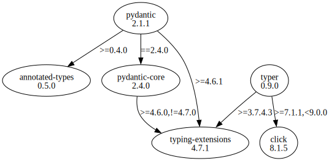

# Third Party Dependencies

<!--[[[fill sbom_sha256()]]]-->
The [SBOM in CycloneDX v1.4 JSON format](https://github.com/sthagen/pilli/blob/default/sbom.json) with SHA256 checksum ([eab0dab6 ...](https://raw.githubusercontent.com/sthagen/pilli/default/sbom.json.sha256 "sha256:eab0dab6181096b957a966e38bd8d2804da8760ddc120b761a3a0ab8255c52b5")).
<!--[[[end]]] (checksum: 61e991a43da7fb84cde4dbb2b98e5b04)-->
## Licenses 

JSON files with complete license info of: [direct dependencies](direct-dependency-licenses.json) | [all dependencies](all-dependency-licenses.json)

### Direct Dependencies

<!--[[[fill direct_dependencies_table()]]]-->
| Name                                             | Version                                             | License     | Author            | Description (from packaging data)                                  |
|:-------------------------------------------------|:----------------------------------------------------|:------------|:------------------|:-------------------------------------------------------------------|
| [pydantic](https://github.com/pydantic/pydantic) | [1.10.2](https://pypi.org/project/pydantic/1.10.2/) | MIT License | Samuel Colvin     | Data validation and settings management using python type hints    |
| [typer](https://github.com/tiangolo/typer)       | [0.6.1](https://pypi.org/project/typer/0.6.1/)      | MIT License | Sebastián Ramírez | Typer, build great CLIs. Easy to code. Based on Python type hints. |
<!--[[[end]]] (checksum: ba7d82529443076bc022241162453539)-->

### Indirect Dependencies

<!--[[[fill indirect_dependencies_table()]]]-->
| Name                                                                                           | Version                                                    | License                            | Author         | Description (from packaging data)                      |
|:-----------------------------------------------------------------------------------------------|:-----------------------------------------------------------|:-----------------------------------|:---------------|:-------------------------------------------------------|
| [click](https://palletsprojects.com/p/click/)                                                  | [8.1.3](https://pypi.org/project/click/8.1.3/)             | BSD License                        | Armin Ronacher | Composable command line interface toolkit              |
| [typing-extensions](https://github.com/python/typing/blob/master/typing_extensions/README.rst) | [4.3.0](https://pypi.org/project/typing-extensions/4.3.0/) | Python Software Foundation License | UNKNOWN        | Backported and Experimental Type Hints for Python 3.7+ |
<!--[[[end]]] (checksum: 6f7fd4c343eb373418db0ee9e885e909)-->

## Dependency Tree(s)

JSON file with the complete package dependency tree info of: [the full dependency tree](package-dependency-tree.json)

### Rendered SVG

Base graphviz file in dot format: [Trees of the direct dependencies](package-dependency-tree.dot.txt)



### Console Representation

<!--[[[fill dependency_tree_console_text()]]]-->
````console
pydantic==1.10.2
  - typing-extensions [required: >=4.1.0, installed: 4.3.0]
typer==0.6.1
  - click [required: >=7.1.1,<9.0.0, installed: 8.1.3]
````
<!--[[[end]]] (checksum: 4b5e787b58b17cf043812336b863be30)-->
