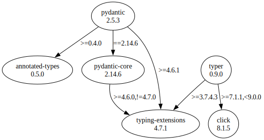

# Third Party Dependencies

<!--[[[fill sbom_sha256()]]]-->
The [SBOM in CycloneDX v1.4 JSON format](https://git.sr.ht/~sthagen/arbejdstimer/blob/default/sbom/cdx.json) with SHA256 checksum ([560a910a ...](https://git.sr.ht/~sthagen/arbejdstimer/blob/default/sbom/cdx.json.sha256 "sha256:560a910ab2c771d83eb7f47833d433ccda52298beef0e41bf4de5a78ce5eba55")).
<!--[[[end]]] (checksum: 1e49aac6d75ea82853ba9cb87e1bcff8)-->
## Licenses 

JSON files with complete license info of: [direct dependencies](direct-dependency-licenses.json) | [all dependencies](all-dependency-licenses.json)

### Direct Dependencies

<!--[[[fill direct_dependencies_table()]]]-->
| Name                                             | Version                                             | License     | Author            | Description (from packaging data)                                  |
|:-------------------------------------------------|:----------------------------------------------------|:------------|:------------------|:-------------------------------------------------------------------|
| [pydantic](https://github.com/pydantic/pydantic) | [1.10.9](https://pypi.org/project/pydantic/1.10.9/) | MIT License | Samuel Colvin     | Data validation and settings management using python type hints    |
| [typer](https://github.com/tiangolo/typer)       | [0.9.0](https://pypi.org/project/typer/0.9.0/)      | MIT License | Sebastián Ramírez | Typer, build great CLIs. Easy to code. Based on Python type hints. |
<!--[[[end]]] (checksum: 9f6a1487e87fb5a35423efb680f85311)-->

### Indirect Dependencies

<!--[[[fill indirect_dependencies_table()]]]-->
| Name                                                             | Version                                                    | License                            | Author                                                                                | Description (from packaging data)                      |
|:-----------------------------------------------------------------|:-----------------------------------------------------------|:-----------------------------------|:--------------------------------------------------------------------------------------|:-------------------------------------------------------|
| [click](https://palletsprojects.com/p/click/)                    | [8.1.3](https://pypi.org/project/click/8.1.3/)             | BSD License                        | Armin Ronacher                                                                        | Composable command line interface toolkit              |
| [typing_extensions](https://github.com/python/typing_extensions) | [4.4.0](https://pypi.org/project/typing_extensions/4.4.0/) | Python Software Foundation License | "Guido van Rossum, Jukka Lehtosalo, Łukasz Langa, Michael Lee" <levkivskyi@gmail.com> | Backported and Experimental Type Hints for Python 3.7+ |
<!--[[[end]]] (checksum: ce9eb9e0a6f0193879b25757445a6732)-->

## Dependency Tree(s)

JSON file with the complete package dependency tree info of: [the full dependency tree](package-dependency-tree.json)

### Rendered SVG

Base graphviz file in dot format: [Trees of the direct dependencies](package-dependency-tree.dot.txt)



### Console Representation

<!--[[[fill dependency_tree_console_text()]]]-->
````console
pydantic==1.10.9
└── typing-extensions [required: >=4.2.0, installed: 4.4.0]
typer==0.9.0
├── click [required: >=7.1.1,<9.0.0, installed: 8.1.3]
└── typing-extensions [required: >=3.7.4.3, installed: 4.4.0]
````
<!--[[[end]]] (checksum: 8b5d0c569487e8947b4bf0d0504e7bdf)-->
